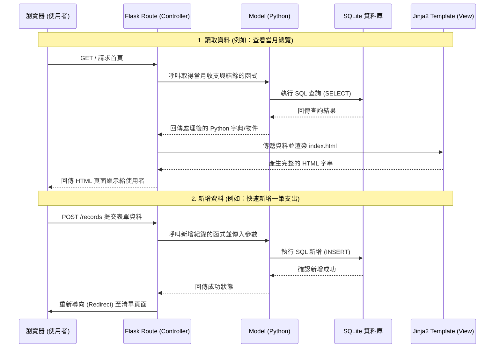

# 系統架構設計 (Architecture) - 個人記帳簿系統

## 1. 技術架構說明

本系統採用經典的單體式（Monolithic）Web 架構，因為這是一個適合個人使用的記帳系統，不需要過度複雜的分散式服務。

### 選用技術與原因
- **後端框架**：Python + Flask。Flask 輕量、靈活且學習曲線平緩，非常適合用來快速開發此類中小型網頁應用。
- **模板引擎**：Jinja2。直接整合在 Flask 中，用於將後端資料渲染成 HTML，不需要處理前後端分離帶來額外的 API 串接與跨域問題。
- **資料庫**：SQLite。無須額外安裝伺服器，資料儲存在單一檔案中，非常適合輕量級應用或單一使用者的系統。
- **前端技術**：HTML, CSS (Vanilla), JavaScript。使用原生網頁技術，無須編譯步驟，讓專案保持單純。

### Flask MVC 模式說明
雖然 Flask 本身不強制要求 MVC，但我們會採用類似 MVC (Model-View-Controller) 的架構來組織程式碼：
- **Model (模型)**：負責與 SQLite 資料庫互動，處理資料邏輯（例如：新增一筆記帳紀錄、計算當月總和）。
- **View (視圖)**：負責呈現畫面，由 Jinja2 模板（`.html`）與前端靜態資源（CSS/JS）組成。
- **Controller (控制器)**：在 Flask 中由 Routes（路由）擔任。負責接收使用者的 HTTP 請求、調用 Model 處理資料，最後將資料傳遞給 View 渲染並回傳給使用者。

---

## 2. 專案資料夾結構

專案將採取模組化的結構，將不同職責的程式碼分開，方便未來的維護與擴充。

```text
web_app_development/
├── app/                  # 應用程式主要資料夾
│   ├── __init__.py       # Flask 應用程式工廠與初始化設定
│   ├── models/           # 模型層 (資料庫與商業邏輯)
│   │   ├── __init__.py
│   │   └── database.py   # SQLite 連線與基本操作封裝
│   │   └── record.py     # 處理記帳紀錄的邏輯
│   │   └── category.py   # 處理收支類別的邏輯
│   ├── routes/           # 控制器層 (Flask 路由)
│   │   ├── __init__.py
│   │   └── main.py       # 首頁、總覽相關路由
│   │   └── records.py    # 記帳紀錄的增刪改查路由
│   │   └── analytics.py  # 統計圖表相關路由
│   ├── templates/        # 視圖層 (Jinja2 HTML 模板)
│   │   ├── base.html     # 共用版面 (包含導覽列)
│   │   ├── index.html    # 首頁 (月度總覽)
│   │   ├── records.html  # 記帳清單與搜尋
│   │   └── form.html     # 新增/編輯表單
│   └── static/           # 靜態資源 (不需經過模板引擎渲染的檔案)
│       ├── css/
│       │   └── style.css # 全域樣式
│       └── js/
│           └── main.js   # 前端互動邏輯 (如確認刪除提示等)
├── instance/             # 存放敏感或不該進版控的執行期檔案
│   └── ledger.db         # SQLite 資料庫檔案
├── docs/                 # 專案文件
│   ├── PRD.md            # 產品需求文件
│   └── ARCHITECTURE.md   # 系統架構設計 (本文件)
├── app.py                # 系統入口檔案，負責啟動伺服器
├── requirements.txt      # Python 依賴套件清單
└── .gitignore            # Git 忽略檔案清單
```

---

## 3. 元件關係圖

以下展示使用者透過瀏覽器操作時，系統各個元件的互動流程：



---

## 4. 關鍵設計決策

1. **採用伺服器渲染 (SSR) 而非單頁應用 (SPA)**
   - **原因**：個人記帳系統的互動多為表單提交與頁面切換。使用 Flask + Jinja2 直接回傳 HTML，可以省去前端框架（如 React/Vue）的建置成本，同時避免 API 設計的複雜度，讓開發速度最快化，非常適合這個規模的專案。

2. **使用 Blueprint 模組化路由**
   - **原因**：雖然這是一個小專案，但將路由拆分到 `routes/` 資料夾並使用 Flask Blueprint，可以避免把所有路由寫在同一個 `app.py` 中造成程式碼過長難以維護。這確保了系統未來如果需要擴充功能時，結構依然清晰。

3. **直接操作 SQLite / 輕量級封裝**
   - **原因**：為保持簡單，初期可以直接使用 Python 內建的 `sqlite3` 模組搭配簡單的 DAO (Data Access Object) 模式封裝 SQL 語法。這降低了 ORM（如 SQLAlchemy）的學習與除錯成本，對於只有幾張資料表（紀錄、類別）的系統來說已經足夠。

4. **將前端資源放在同一包 (不分離靜態伺服器)**
   - **原因**：靜態資源（CSS、JS）與 Flask 程式碼放在同一個專案結構下，由 Flask 伺服器一併提供服務。這大幅降低了部署的難度，使用者在本地端只需要執行單一指令即可完整啟動整個記帳系統。
