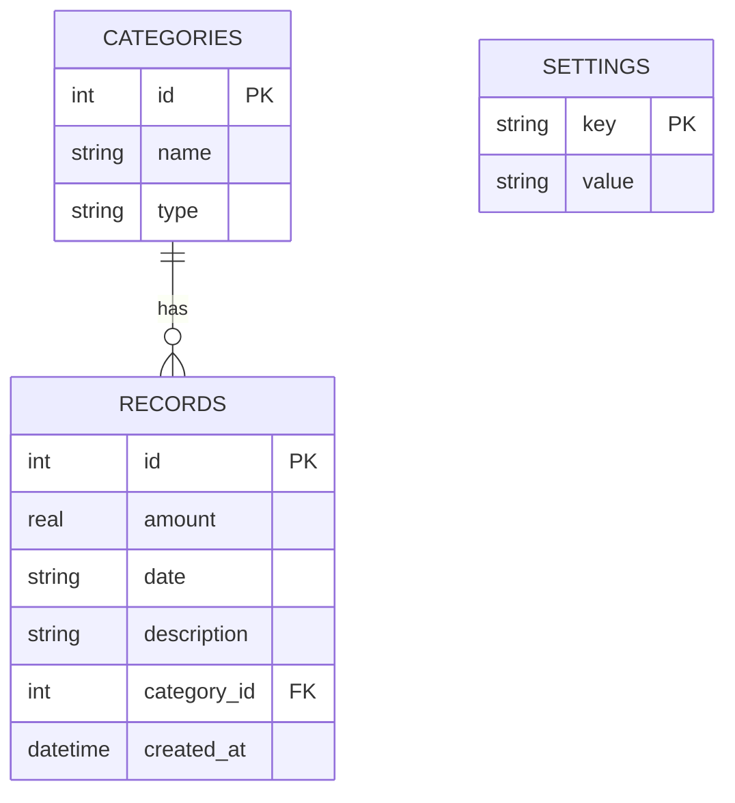

# 資料庫設計 (Database Design) - 個人記帳簿系統

## 1. ER 圖 (實體關係圖)

## 2. 資料表詳細說明

### 2.1 CATEGORIES (類別表)
儲存收支的類別，例如「餐飲」、「交通」、「薪水」等。
- `id` (INTEGER): 主鍵，自動遞增。
- `name` (TEXT): 類別名稱，必填。
- `type` (TEXT): 類別屬性，必填，只能是 `income` (收入) 或 `expense` (支出)。

### 2.2 RECORDS (收支紀錄表)
儲存使用者的每一筆花費或收入紀錄。
- `id` (INTEGER): 主鍵，自動遞增。
- `amount` (REAL): 金額，必填。使用 REAL 支援小數，若只用整數也相容。
- `date` (TEXT): 消費日期，必填，格式為 `YYYY-MM-DD`。
- `description` (TEXT): 備註/說明，非必填。
- `category_id` (INTEGER): 外鍵，關聯至 `CATEGORIES` 表的 `id`。若類別被刪除，建議限制刪除此類別以保護紀錄完整性。
- `created_at` (TEXT): 系統建立時間，預設為當下時間，格式為 ISO 8601 (`YYYY-MM-DD HH:MM:SS`)。

### 2.3 SETTINGS (系統設定表)
簡單的 Key-Value 結構，用來儲存全域設定，如使用者的每月預算。
- `key` (TEXT): 主鍵，設定項目的名稱，例如 `monthly_budget`。
- `value` (TEXT): 設定項目的值。
