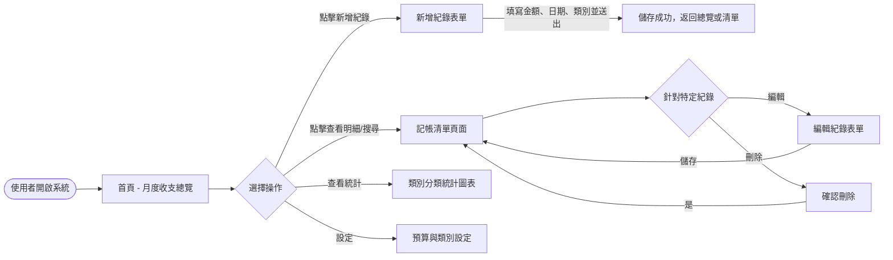
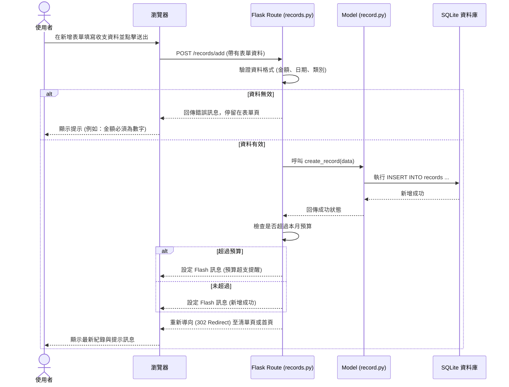

# 流程圖設計 (Flowchart) - 個人記帳簿系統

## 1. 使用者流程圖 (User Flow)
描述使用者在系統中的主要操作路徑。

## 2. 系統序列圖 (Sequence Diagram)
描述「使用者新增記帳紀錄」的完整系統互動流程。

## 3. 功能清單對照表

| 功能描述 | URL 路徑 | HTTP 方法 | 負責的 Flask Route |
| --- | --- | --- | --- |
| 首頁 (月度收支總覽) | `/` | GET | `main.index` |
| 記帳清單 (含搜尋與篩選) | `/records` | GET | `records.list_records` |
| 顯示新增紀錄表單 | `/records/add` | GET | `records.add_record_form` |
| 處理新增紀錄請求 | `/records/add` | POST | `records.add_record` |
| 顯示編輯紀錄表單 | `/records/edit/<id>` | GET | `records.edit_record_form` |
| 處理編輯紀錄請求 | `/records/edit/<id>` | POST | `records.edit_record` |
| 處理刪除紀錄請求 | `/records/delete/<id>` | POST | `records.delete_record` |
| 類別分類統計頁面 | `/analytics` | GET | `analytics.show_stats` |
| 預算與類別設定 | `/settings` | GET | `main.settings` |
| 更新預算設定 | `/settings/budget` | POST | `main.update_budget` |
